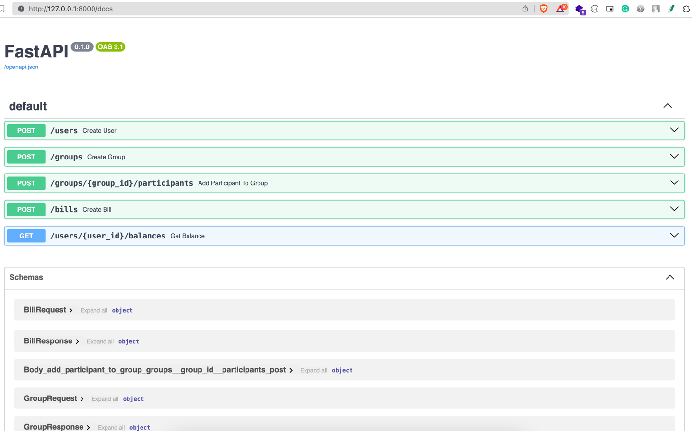
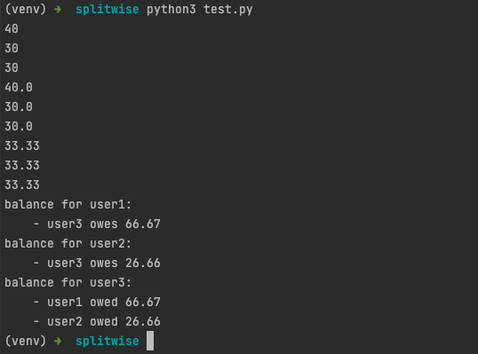

# Splitwise

## Design
Actors:
- User
- System

Models:
- User -- name, email
- Group -- name, members
- Bill -- amount, title, created_by, splits
- Split -- bill, split_amount, user_id, percentage, share

APIs:
- register_user(email, name) -> id
- create_goup(name, creator_id) -> id
- add_user(group_id, user_id) -> id
- create_bill(amount, title, splits: List[Split])
- list_splits(user_id, group_id)
- settle(user_id, friend_id)
- get_balance(user_id)

Keeping out of scope for now:
- Editing an existing bill
- Group simplify balances
- Using decimal type for currency instead of float, error margin taken as 0-1 
- Setup proper logger
- Authentication and authorization for apis

## Setup
- Install Python if not already https://wiki.python.org/moin/BeginnersGuide/Download
- Install the requirements using: `python3 -m pip install -r requirements.txt`
- Start server: `uvicorn api.server:app --reload`
- Explore the doc and apis here: http://127.0.0.1:8000/docs

## Try out
- General flow can be seen and tried out by looking and modifying `test.py`

- Flow looks like:
  - Register users: `POST /users`
  - Create group: `POST /groups`
  - Add users to the group: `POST /groups/:group_id`
  - Create bill: `POST /bills`
  - Check balance for user: `GET /balance`
  
## Not yet implemented
- [ ] Balance settling api
- [ ] Getting balances for user only in the group
  

## Sample bill request to try out
 
> POST /bills
```json
{
  "group_id": "group-id",
  "split_type": "EQUAL",
  "title": "bill 1",
  "amount": 100,
  "payers": [
    {
      "user_id": "u1@example.com",
      "amount": 40
    },
    {
      "user_id": "u2@example.com",
      "amount": 60
    }
  ],
  "splits": [
    {
      "user_id": "u1@example.com"
    },
    {
      "user_id": "u2@example.com"
    },
    {
      "user_id": "u3@example.com"
    }
  ]
}
```